# Overview

Analyzer lets you view, analyze and join tables across multiple heterogeneous databases. The following functions are available:

* Create a connection to a server database (via JDBC)
* Display database connections and tables
* Display contents of multiple tables
* Join tables horizontally and vertically
* Select and rename columns
* Add expanded columns (e.g. break date in components)
* Add calculated columns
* Select rows (e.g. conditional filtering)
* Specify sort orders and directions
* Show table analysis history
* Summarize columns

The server includes a simple database implementation that manages a copy of the external data. The current implementation is limited by available virtual memory, but the architecture is designed to accomodate alternative implementations.
 
The browser-based client displays activities in a toolbox on the left and tables in a tabbed panel on the right. One or more activities or tables can be detached, resulting in an animated display of the activity in the main window area where they can be resized as necessary.

# A tour of the Analyzer user interface

## Creating a Connection

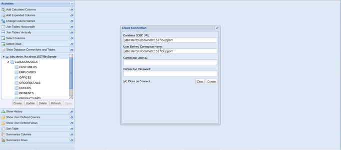

## Showing Database Connections and Tables

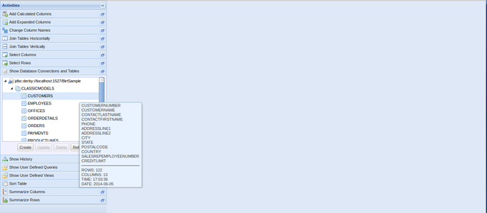

## Opening a Table

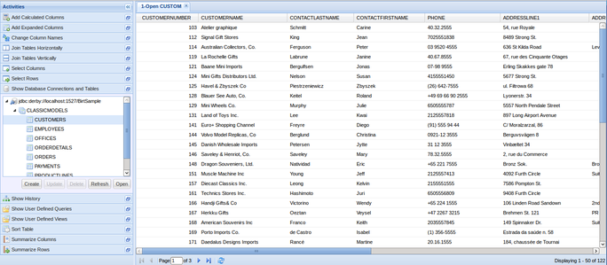

## Opening Multiple Tables

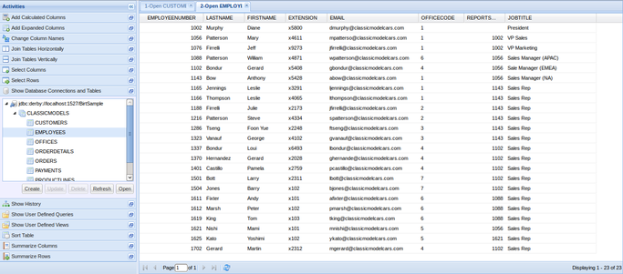

## Joining Tables Horizontally

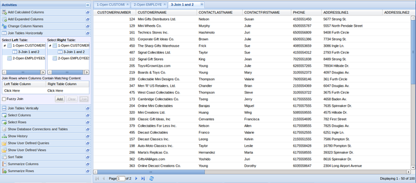

## Selecting Columns

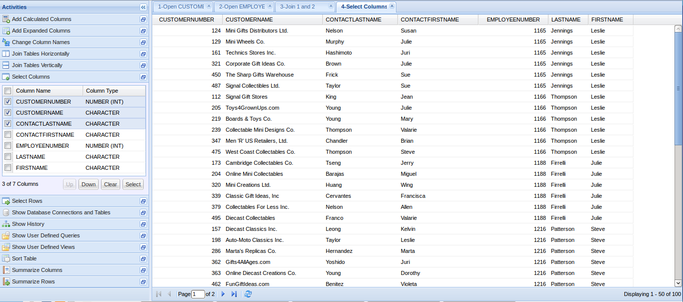

## Changing Column Names

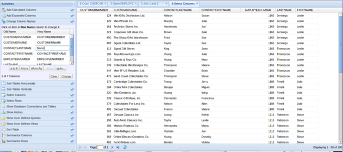

## Adding Expanded Columns

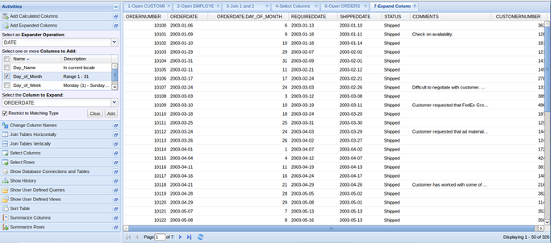

## Selecting Rows

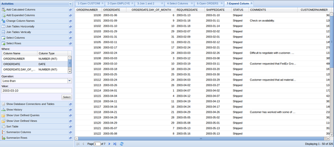

## Sorting a Table

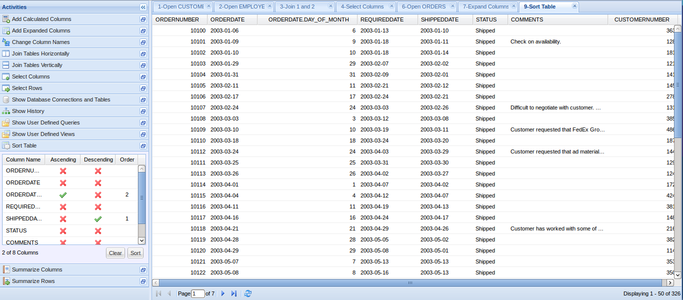

## Showing History

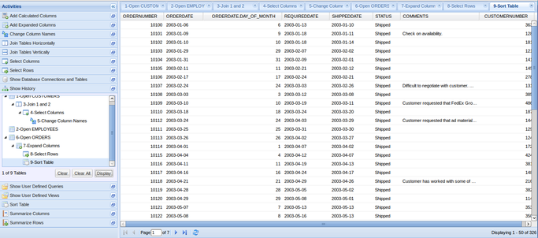

## Adding Calculated Columns

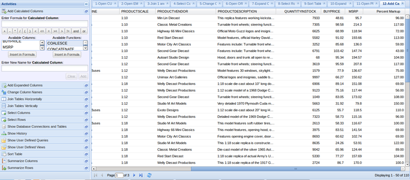

## Expanding Activity Panels

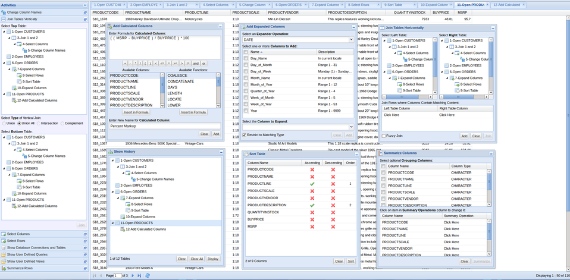

## Expanding Table Panels

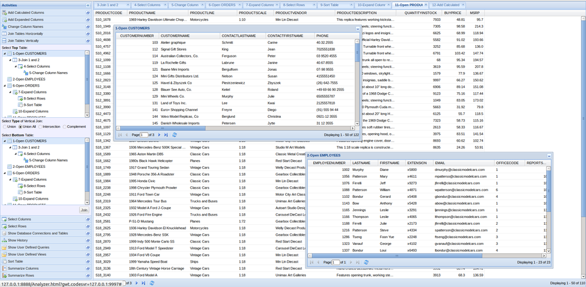

